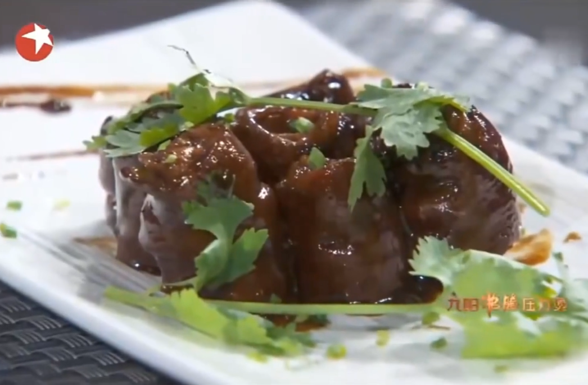
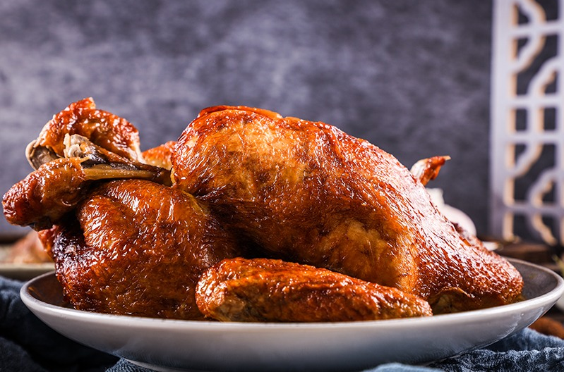
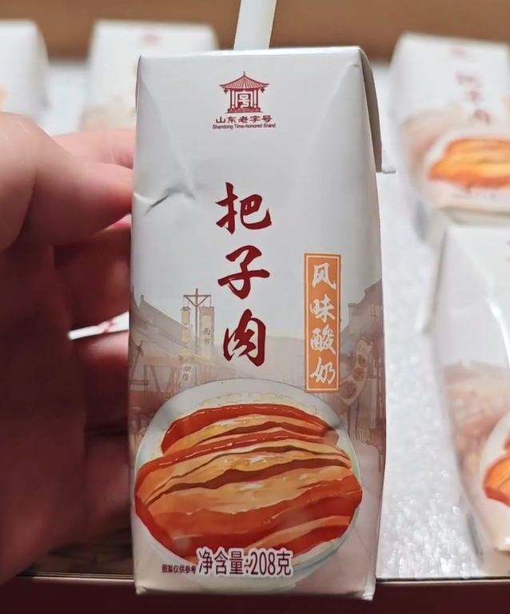

# 🍛 The Lu Cuisine 🥢

Reported by: montmorillonite & his partners

- Culinary Legacy of Shandong
- First Among China's Eight Great Cuisines
- 2,500 Years of Culinary Excellence
- UNESCO Heritage Candidate
- 60% Chinese Banquet Techniques

---
transition: fade-out
layout: image-right
image: https://images.unsplash.com/photo-1523905330026-b8bd1f5f320e
---

## **Introduction to Lu Cuisine**

- Lu Cuisine is the first of the Eight Great Cuisines of China, originating from Shandong Province.

- It is known for its savory and fresh flavors, emphasizing the natural taste of ingredients, and focuses on knife skills and cooking techniques.

- It is divided into three major branches:
  - Jinan Cuisine
  - Jiaodong Cuisine
  - Confucian Mansion Cuisine

---
transition: slide-up
layout: image-left
image: https://images.unsplash.com/photo-1496136998968-81293d01179b
---

## **History and Development of Lu Cuisine**

 

- **Origins**: Lu Cuisine has a long history, dating back to the Spring and Autumn Period and the Warring States Period.
- **Development**: It reached its peak during the Ming and Qing dynasties, becoming a representative of imperial cuisine.
- **Influence**: Lu Cuisine has had a profound impact on other regional cuisines, such as Beijing and Tianjin cuisines.

---
layout: two-cols-header
layoutClass: gap-col-8
---

## **Classic Lu Cuisine Dishes**

::left::

**Braised Intestines in Brown Sauce**: 
Tender pork intestines braised in a rich, savory brown sauce, featuring a combination of sweet, sour, bitter, spicy, and salty flavors, offering a unique and flavorful experience.

::right::

**Sweet and Sour Carp**: 
Crispy on the outside and tender on the inside, with a sweet and sour taste, shaped like a carp leaping over a dragon gate.

<v-switch>
  <template #0>
    
  </template>
  <template #1>
    
  </template>
</v-switch>

---
layout: two-cols-header
layoutClass: gap-col-8
---

## **Classic Lu Cuisine Dishes**

::left::

**Braised Sea Cucumber with Scallions**: 
Succulent sea cucumbers braised with green onions in a rich, savory sauce, offering a delicate balance of umami and a slight sweetness, providing a luxurious and melt-in-your-mouth experience.

::right::

**Dezhou Braised Chicken**: 
Tender and flavorful chicken, slow-cooked to perfection with a blend of aromatic spices, featuring a crispy skin and juicy meat, embodying the traditional taste of Dezhou cuisine.

---
layout: two-cols
layoutClass: gap-24
transition: slide-up
---

## **To the Future**

**Bazirou-flavored Yogurt**: 

An innovative fusion dish that combines traditional Chinese braised pork (*Bazirou*) with yogurt, offering a unique flavor experience.

The slow-cooked pork is tender and rich in savory sauce, paired with the refreshing tanginess of yogurt, which not only balances the richness but also adds a complex layer of texture.

This cross-cultural blend preserves the classic taste of braised pork while incorporating the health benefits of yogurt, making it an ideal choice for adventurous food enthusiasts.

::right::

---
layout: section
---

## **Conclusion of Lu Cuisine**

<v-clicks>

- Focuses on fresh ingredients, precise techniques, and elegant presentation.
- Represents the essence of Chinese gastronomy and cultural heritage.
- Serves as a bridge between tradition and modern culinary innovation.
- Embodies harmony, balance, and umami-rich flavors, influenced by Confucian philosophy.

</v-clicks>

 

<v-click>
With its long history, exquisite techniques, and rich cultural significance, 
Lu Cuisine is an essential part of Chinese culinary culture. Through Lu Cuisine, 
we can appreciate the culinary wisdom and cultural heritage of Shandong Province. 
It's a timeless art form that continues to inspire and captivate globally.
</v-click>

---
layout: quote
---

# Governing a great nation is like cooking a small fish.

Laozi

---
layout: end
---

# 鲁菜，杠赛来！

 

## Thank You For Listening!
